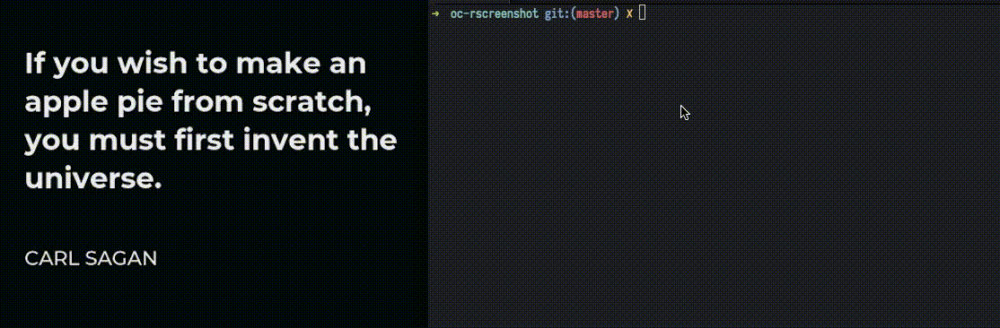

# oc-rscreenshot


Inspired by the project: [imgur-screenshot](https://github.com/jomo/imgur-screenshot).
A bash script to use the rust ocr binary from [oc-rs](https://github.com/pauloasjx/oc-rs).

The inference time is around 500ms, but you can use another model if you want.
Can add a shortcut too.

```bash
$ ./oc-rscreenshot -h

usage: ./oc-rscreenshot [--debug] [-c | -v | -h | -u]
       ./oc-rscreenshot [--debug] [option]... [file]...

      --debug                  Enable debugging, must be first option

  -h, --help                   Show this help, exit
  -v, --version                Show current version, exit

  -s, --select                 Take screenshot in select mode
  -w, --window                 Take screenshot in window mode
  -f, --full                   Take screenshot in full mode
```

Example
```bash
$ ./oc-rscreenshot -s
```
<br/>
<center>

</center>
<br/>

# Dependencies:
MacOS:
-  bash version >= 4.0
-  pbcopy
-  oc-rs

Linux:
-  scrot
-  xclip
-  oc-rs